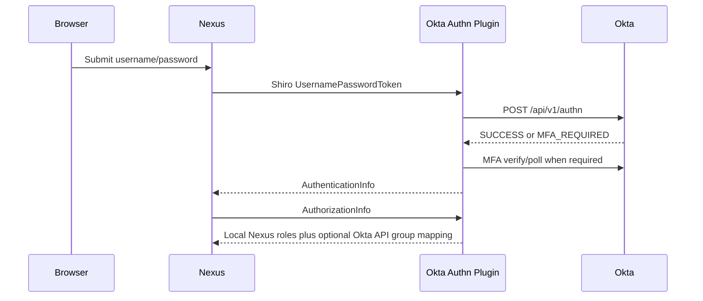
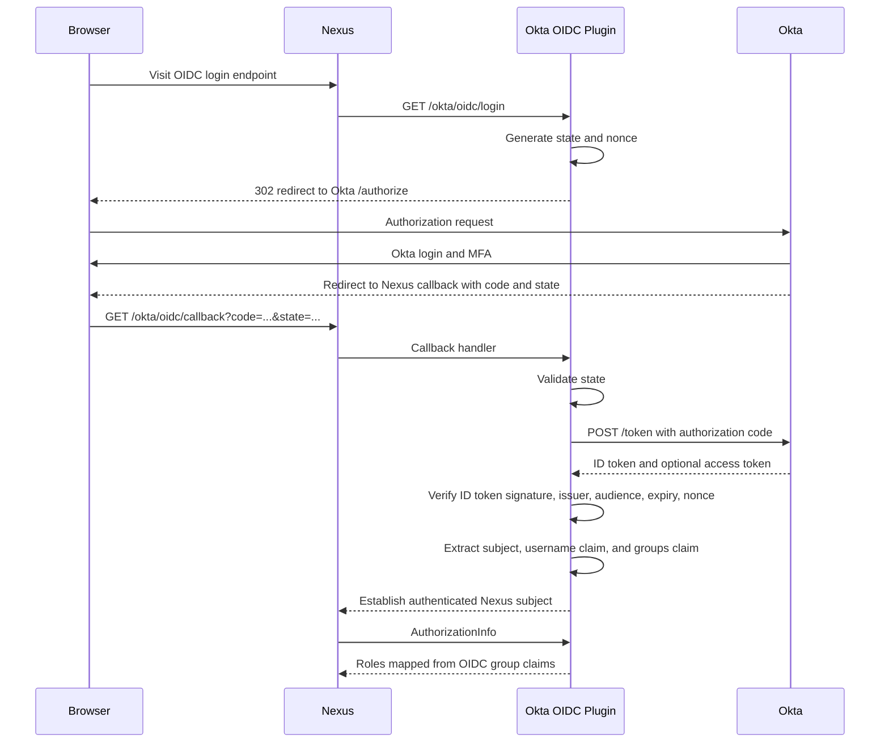

# Okta OIDC Login Flow

## Goal

Replace the current Okta Classic Authn API login flow with an OpenID Connect Authorization Code flow.

The OIDC flow should let Okta own primary authentication, MFA, and session policy while Nexus receives a verified identity and mapped roles.

References:

- Okta OpenID Connect overview: https://www.okta.com/openid-connect/
- Okta OIDC and OAuth 2.0 API reference: https://developer.okta.com/docs/reference/api/oidc/
- Okta groups claim guide: https://developer.okta.com/docs/guides/customize-tokens-groups-claim/main/
- OpenID Connect Core 1.0: https://openid.net/specs/openid-connect-core-1_0-18.html

## Current Flow



This flow is not SAML or OIDC. It directly handles user passwords and uses an Okta API token only when group lookup is enabled.

## Target OIDC Flow



## Claims

The plugin should support these configurable claims:

- `oidc.username.claim`: default `preferred_username`
- `oidc.groups.claim`: default `groups`

The Okta app must be configured to include group claims in the ID token or the UserInfo response. Prefer a filtered group claim so Nexus only receives groups relevant to Nexus.

## Role Mapping

Use the existing mapping shape:

```properties
oidc.group.role.mapping=Okta Admins=nx-admin,Developers=nx-developer
```

The OIDC implementation should not require an Okta API token for RBAC when the groups claim is present.

## Security Requirements

- Use Authorization Code flow, not implicit flow.
- Generate high-entropy `state` for CSRF protection.
- Generate and validate `nonce` for ID token replay protection.
- Validate issuer exactly against configured Okta issuer.
- Validate audience exactly against configured client ID.
- Validate token expiry and issued-at tolerance.
- Validate ID token signature against the issuer JWKS.
- Allow only configured redirect URIs.
- Store client secrets outside published images.
- Avoid logging tokens, authorization codes, client secrets, or raw claims.
- Fail closed when required claims or mapped roles are missing.

## Configuration Draft

```properties
oidc.enabled=true
oidc.issuer=https://your-org.okta.com/oauth2/default
oidc.client.id=<client-id>
oidc.client.secret=<client-secret>
oidc.redirect.uri=http://localhost:8081/okta/oidc/callback
oidc.scopes=openid,profile,email,groups
oidc.username.claim=preferred_username
oidc.groups.claim=groups
oidc.group.role.mapping=Okta Admins=nx-admin,Developers=nx-developer
```

## Open Questions

- The exact Nexus 3.92.0-supported way to establish a web subject from a custom OIDC callback must be validated against runtime internals.
- The login UX needs a reliable entry point. Options include a direct `/okta/oidc/login` URL first, then UI integration later.
- Single logout can be added after login works; it should not block the first OIDC milestone.
